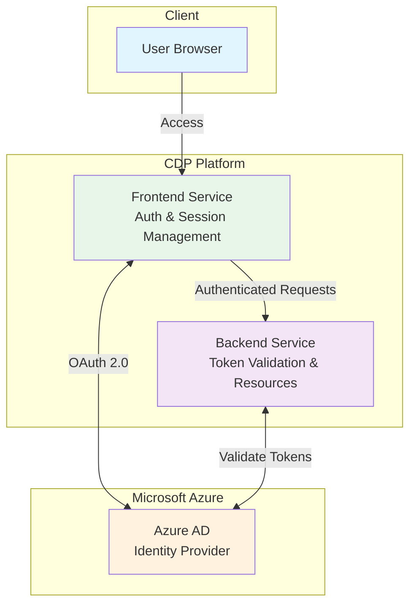
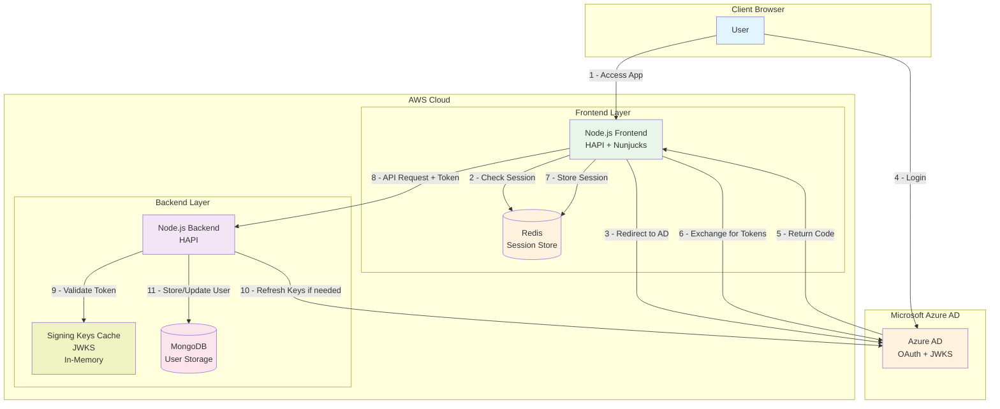
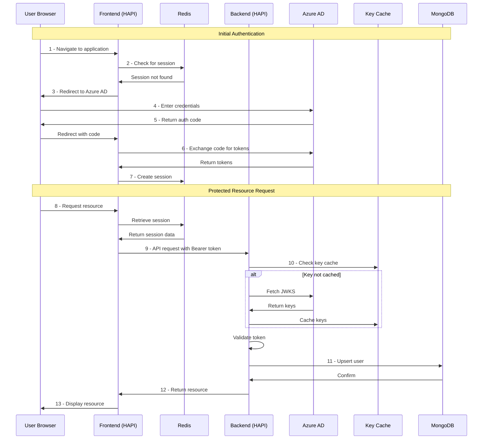
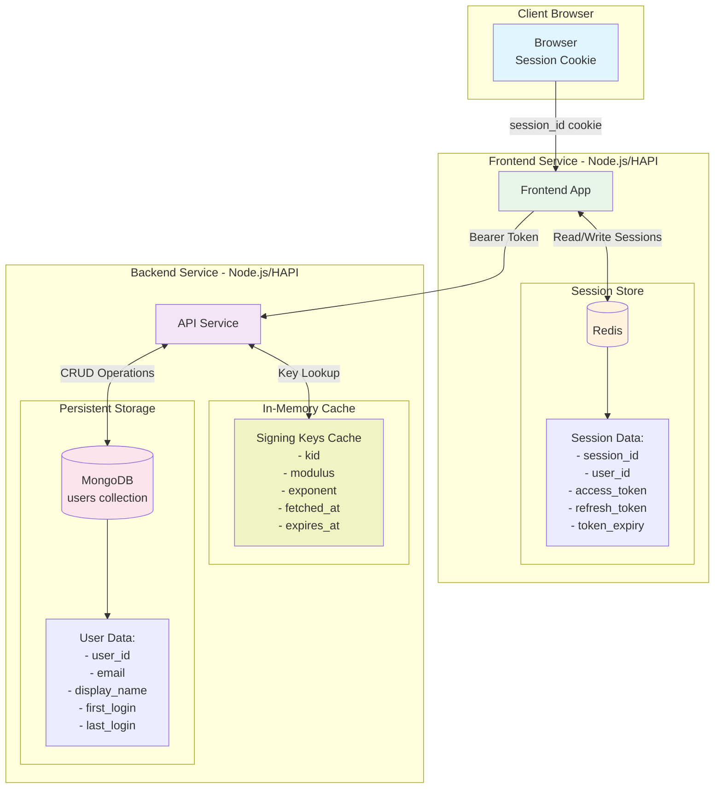
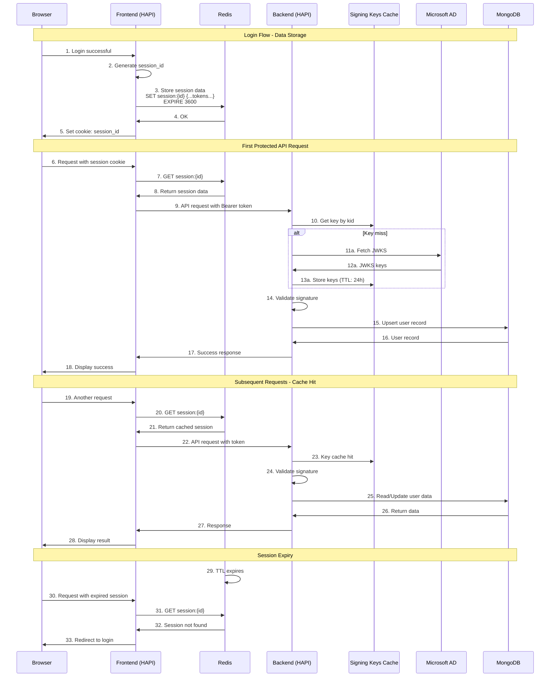

# Architecture Decision Record: Azure Active Directory Authentication Integration

## 1. Context

This document describes the implementation of authentication, authorisation and user account capabilities for a CDP application consisting of a JavaScript frontend service and a JavaScript backend service, both utilising Node.js and HAPI. Microsoft Azure Active Directory serves as the identity provider using OAuth 2.0. This approach provides a simple, secure and minimalist architecture that maintains clear separation of concerns whilst allowing straightforward extension of capabilities as requirements evolve.

## 2. High Level Diagram

## ## 3. Implementation Details

### 3.1 Frontend Service (Node.js/HAPI)

The frontend service handles:

- OAuth 2.0 authorisation code flow with Azure AD
- Session management using Redis with configurable TTL
- Token storage and refresh logic
- Bearer token injection for backend API calls
- Server-side rendering with Nunjucks templates

**Session Data Structure (Redis):**

`{ "session_id": "unique identifier", "user_id": "extracted from Azure AD oid claim", "access_token": "JWT for API authorisation", "refresh_token": "for obtaining new access tokens", "token_expiry": "token expiration timestamp" }`

### 3.2 Backend Service (Node.js/HAPI)

The backend service implements:

- JWT validation using cached JWKS signing keys
- Automatic JWKS refresh on cache miss or expiry
- User record management in MongoDB
- Bearer token extraction from Authorization header
- Shared resource management (user profiles, etc.)

**Signing Key Cache (In-Memory):**

`{ "kid": "key identifier", "modulus": "RSA public key modulus", "exponent": "RSA public key exponent", "fetched_at": "timestamp of key retrieval", "expires_at": "cache expiry timestamp" }`

**User Data Structure (MongoDB):**

`{ "user_id": "unique identifier from Azure AD", "email": "user email address", "display_name": "user display name", "first_login": "timestamp of first login", "last_login": "timestamp of most recent login" }`

## 4. Security Considerations

- **Token validation**: All API requests validate JWT signatures using Azure AD public keys
- **Key caching**: JWKS signing keys cached to reduce Azure AD dependencies
- **Session security**: Redis sessions expire after configured duration
- **Session identifiers**: Generated using cryptographically secure methods
- **Token refresh**: Automatic token refresh before expiry

## 5. Error Handling

- Invalid tokens return 401 Unauthorized
- Expired sessions redirect to Azure AD login
- Backend service unavailability returns 503 Service Unavailable

## 6. Architecture

### 6.1 Authentication Flow

The authentication journey follows these steps:

- User navigates to the application
- Frontend checks for valid session in Redis
- If no valid session exists, frontend redirects to Azure AD
- User authenticates with Azure AD credentials
- Azure AD returns authorisation code to frontend
- Frontend exchanges code for access and refresh tokens
- Frontend creates session in Redis with token information
- User makes request for protected resource
- Frontend attaches bearer token to backend API request
- Backend validates token using cached signing keys
- Backend creates or updates user record in MongoDB
- Backend returns requested resource to frontend
- Frontend renders response for user

\*\*System Architecture:

**Authentication Sequence:**

### 6.2 Data Architecture and Storage Flow

The following diagrams illustrate the technical implementation of data storage and flow throughout the authentication system. They demonstrate how session data is maintained in Redis alongside the frontend service, whilst persistent user data resides in MongoDB with the backend service. This separation ensures optimal performance for session management whilst maintaining data integrity for user records.

**Data Architecture:**

**Data Storage Flow:**

## 7. Next Steps

Following approval of this RFC, the next steps will be to provide the following documents:

- Technical implementation guide
- API authentication reference

## 8. Open Questions

- What is the preferred session timeout duration for Redis TTL?
- Should role-based access control be implemented in the initial release?
- Are there specific audit log requirements for authentication events?
- Are there compliance requirements (GDPR, SOC2) that affect data retention?

## 9. Request for Feedback

All feedback is welcome, particularly on the following aspects of this architecture:

- Overall architectural approach and technology alignment
- Security considerations and potential vulnerabilities
- Performance implications of the caching strategy
- Compatibility with existing CDP templates and patterns
- User experience considerations for the authentication flow
- Operational requirements for monitoring and maintenance

Please provide feedback by commenting on this document.
